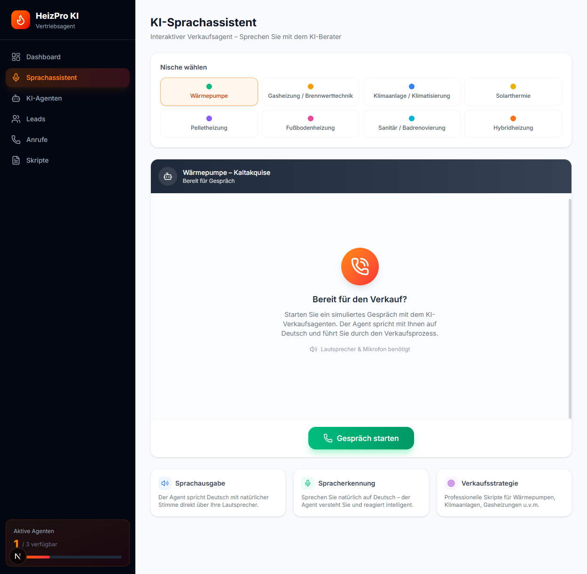
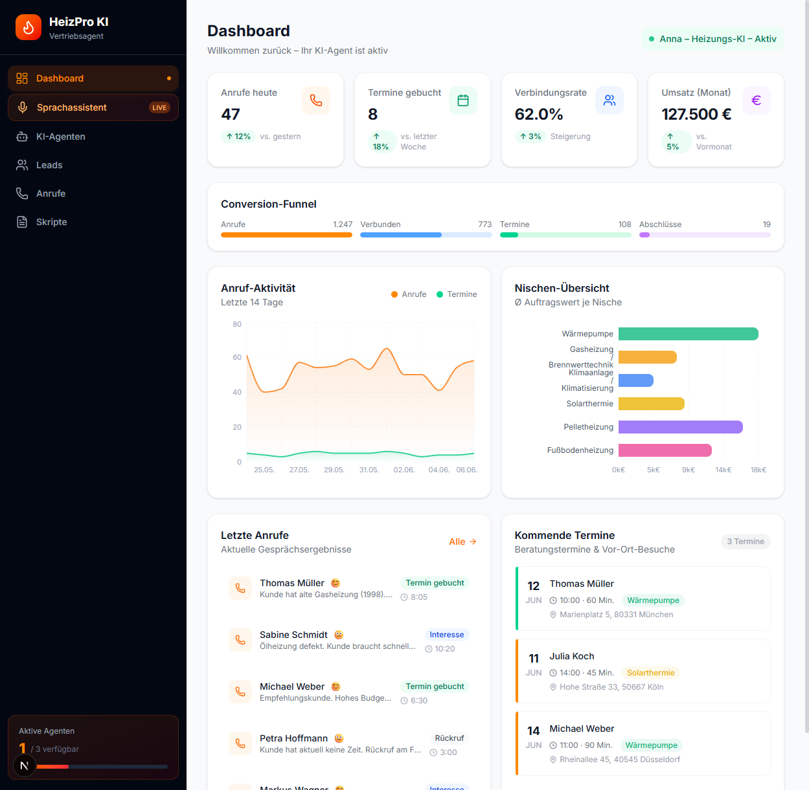

# HeizPro KI — an AI voice agent that answers real sales calls

**Talk to it live: [mischa.mokka-dev.de](https://mischa.mokka-dev.de)**

https://github.com/user-attachments/assets/4a67b4e1-f58e-4039-81f6-167f39737da1



A heating company was missing inbound calls while out on jobs. Answering services are expensive, chatbots don't answer phones. So this: a voice agent that picks up, holds a real-time German conversation, qualifies the lead (who, what, where, how urgent), and writes a structured record the human can call back on.

## What's inside

- **Live voice conversation** — continuous speech recognition with silence debounce, TTS with automatic voice fallback, responses only to final speech (the transcript's half-sentences never reach the agent)
- **Two-agent simulator** — a customer persona agent plays real inbound calls against the sales agent, so conversation quality is testable without anyone picking up a phone
- **Lead dashboard** — every conversation lands as a structured lead record (drizzle/PostgreSQL)



## Stack

Next.js (App Router) · TypeScript · ElevenLabs voice (`@elevenlabs/react`) · OpenAI (agent logic) · Drizzle ORM + PostgreSQL · Framer Motion · Docker

## The unglamorous part (where the work actually went)

Voice agents fail in the boring places, so that's where the commits are: a mic stale-closure bug that froze recognition after the first reply, TTS dying when the configured voice was unavailable (now falls back instead of going silent), and the recognition loop firing on interim results (now only final speech triggers a response). None of it is clever. All of it is the difference between a demo and something a customer can call.

## Run it

```bash
cd heizung-agent
pnpm install
cp .env.example .env   # ELEVENLABS + OPENAI keys
pnpm dev
```

Built by [Youssef Ouhaghi Ahmian](https://github.com/Gjusev). More production AI systems at [mokka-agentur.de](https://mokka-agentur.de).
